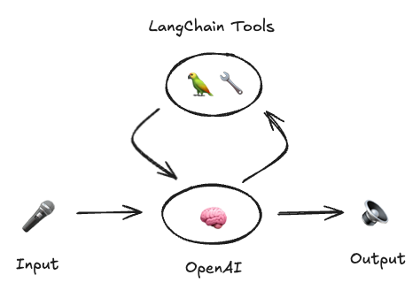

# 🦜🎤 Voice ReAct Agent

This is an implementation of a [ReAct](https://arxiv.org/abs/2210.03629)-style agent that uses OpenAI's new [Realtime API](https://platform.openai.com/docs/guides/realtime).

Specifically, we enable this model to call tools by providing it a list of [LangChain tools](https://python.langchain.com/docs/how_to/custom_tools/#creating-tools-from-functions). It is easy to write custom tools, and you can easily pass these to the model.



## Installation

Make sure you're running Python 3.10 or later, then install `uv` to be able to run the project:

```bash
pip install uv
```

And make sure you have both `OPENAI_API_KEY` and `TAVILY_API_KEY` environment variables set up.

```bash
export OPENAI_API_KEY=your_openai_api_key
export TAVILY_API_KEY=your_tavily_api_key
```

Note: the Tavily API key is for the Tavily search engine, you can get an API key [here](https://app.tavily.com/). This is just an example tool, and if you do not want to use it you do not have to (see [Adding your own tools](#adding-your-own-tools))

## Running the project

To run the project, execute the following command:

```bash
cd server
uv run src/server/app.py
```

## Open the browser

Now you can open the browser and navigate to `http://localhost:3000` to see the project running.

### Enable microphone

You may need to make sure that your browser can access your microphone.

- [Chrome](http://0.0.0.0:3000/)

## Adding your own tools

You can add your own tools by adding them to the `server/src/server/tools.py` file.

## Adding your own custom instructions

You can add your own custom instructions by adding them to the `server/src/server/prompt.py` file.

## Next steps

[] Enable interrupting the AI
[] Enable changing of instructions/tools based on state
